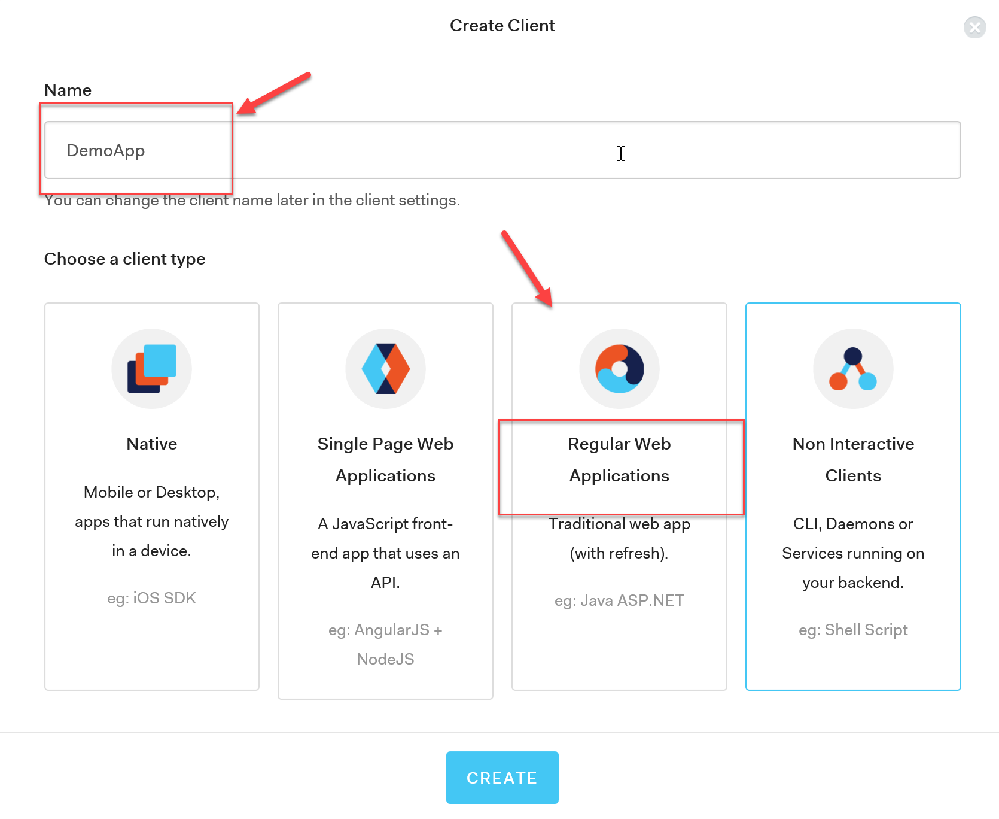
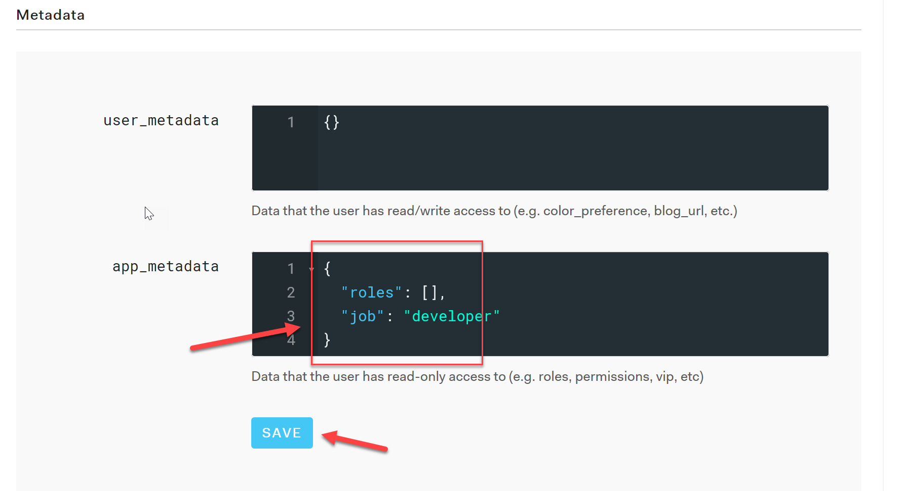
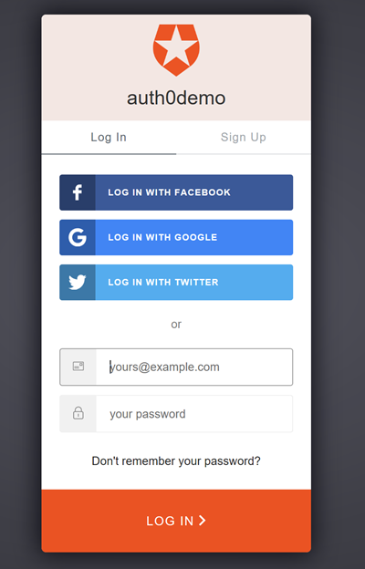

# Introcuction

This is an end-to-end solution that demonstrates how to use Auth0 to secure an ASP.NET Core application and then extend the authentication mechanism to secure access to a back-end web api. 

Auth0 is a delegated authentication service which allows you to decouple the authentication and authorisastion process from your application. Like Azure AD (B2C) and IdentityServer, the idea
behind the delegated authentication is that you, as a developer and in extension as a company, don't have to worry about how to implement this functinality right, securily and in a way that
it can scale out as your demand in your application grows.

In this post, I'll attempt to show you how to implement the solution and use Role-based authorisation to access your API.

## 1. Getting a copy of the project

To grab a copy of the sample code, you can download the zip or clone it locally:
`git clone https://github.com/cmatskas/auth0demo.git`

## 2. Create the Auth0 application
To allow our ASP.NET Core application to integrate with Auth0, we need an Auth0 application. The instructions on how to set this up can be found [here](https://auth0.com/docs/quickstart/webapp/aspnet-core/v2/00-intro). However, I've added a quick guide here as well if you prefer to follow along

On your Auth0 **Dashboard**, click on **Clients** and then click on the *Big Red Button* to **+Create New Client**. On the modal window, choose a meaningful name for your app and then, since we're working with ASP.NET Core, choose **Regular Web Application** as per the image below:



Once the application is created, skip the quick start and go to the **Settings Tab** which contains the information you need in order to configure your ASP.NET Core application:


You can follow the Auth0 walkthrough that explains what you need to do to [setup your application](https://auth0.com/docs/quickstart/webapp/aspnet-core#get-your-application-keys) (Auth0 calls it Client) and how to to [get your Auth0 client keys](https://auth0.com/docs/quickstart/webapp/aspnet-core#get-your-application-keys). Finally, since this applicaiton will need to access an API, we also need to [configure the JWT token](https://auth0.com/docs/quickstart/webapp/aspnet-core#configure-json-web-token-signature-algorithm) (i.e. the access token for authenticating in the API) 

## 3. Edit the project with your settings
With the Auth0 settings in place, we can now edit our web application's `appsettings.json` with the Auth0 information. Open the file and populate the values below:

```
"Auth0": {
    "Domain": "{yourAuth0domainname}.eu.auth0.com",
    "ClientId": "{your Auth0 Client ID}",
    "ClientSecret": "{your Auth0 Client Secret}",
    "CallbackUrl": "http://localhost:1102/signin-auth0"
} 
```

> [!WARNING]
> You should avoid using sensitive information like ClientSecret, API Keys etc in your `appsettings.json` because they are stored in clear text. You should use a service like Azure KeyVault to store and pull this data as needed. More info on using KeyVault can be found [here](https://cmatskas.com/securing-asp-net-core-application-settings-using-azure-key-vault/). 

## 4. Add the Authentiction middleware

The setup for Auth0 is fairly straightforward. Comparing this to the Azure AD integration, the Auth0 is much easier to work with. The code that adds the authentication middleware is provided below:

```
public void ConfigureServices(IServiceCollection services)
{
    services.AddAuthentication(options =>
    {
        options.DefaultAuthenticateScheme = CookieAuthenticationDefaults.AuthenticationScheme;
        options.DefaultSignInScheme = CookieAuthenticationDefaults.AuthenticationScheme;
        options.DefaultChallengeScheme = CookieAuthenticationDefaults.AuthenticationScheme;
    })
    .AddCookie()
    .AddOpenIdConnect("Auth0", options =>
    {
        // Set the authority to your Auth0 domain
        options.Authority = $"https://{Configuration["Auth0:Domain"]}";

        // Configure the Auth0 Client ID and Client Secret
        options.ClientId = Configuration["Auth0:ClientId"];
        options.ClientSecret = Configuration["Auth0:ClientSecret"];

        options.ResponseType = "code";

        options.Scope.Clear();
        options.Scope.Add("openid");
        options.Scope.Add("profile");

        options.SaveTokens = true;
        options.CallbackPath = new PathString("/signin-auth0");
        options.ClaimsIssuer = "Auth0";

        options.TokenValidationParameters = new TokenValidationParameters
        {
            NameClaimType = "name",
            RoleClaimType = "http://schemas.microsoft.com/ws/2008/06/identity/claims/roles"
        };

        options.Events = new OpenIdConnectEvents
        {
            OnRedirectToIdentityProvider = context =>
            {
                context.ProtocolMessage.SetParameter("audience", @"http://auth0demoApi");
                return Task.FromResult(0);
            },
            // handle the logout redirection 
            OnRedirectToIdentityProviderForSignOut = (context) =>
            {
                var logoutUri = $"https://{Configuration["Auth0:Domain"]}/v2/logout?client_id={Configuration["Auth0:ClientId"]}";

                var postLogoutUri = context.Properties.RedirectUri;
                if (!string.IsNullOrEmpty(postLogoutUri))
                {
                    if (postLogoutUri.StartsWith("/"))
                    {
                        var request = context.Request;
                        postLogoutUri = $"{request.Scheme}://{request.Host}{request.PathBase}{postLogoutUri}";
                    }
                    logoutUri += $"&returnTo={Uri.EscapeDataString(postLogoutUri)}";
                }

                context.Response.Redirect(logoutUri);
                context.HandleResponse();

                return Task.CompletedTask;
            }
        };
    });

    services.AddMvc();
}

public void Configure(IApplicationBuilder app, IHostingEnvironment env)
{
    //...other code omitted

    app.UseStaticFiles();

    app.UseAuthentication();

    //...other code omitted
}
```

At a very high level, the code above does the following:
 
- adds authentication to the `services`
- configures the middleware to store the tokens to reuse later
- increases the scope to `open_id` and `profile` to get all the users' profile details 
- adds an `audience` to request the API access permissions to be included in the scope
- maps the token claims to the user name and user role respectively

## 5. Create the login/logout actions
Once the middleware is in place we can then add the login and logout actions. These actions are used to proxy to Auth0's login page and send a request to clear out the auth session when a user logs out. Create a new controller, name it `AccountController.cs` and add the following code:

```
public async Task Login(string returnUrl = "/")
{
    await HttpContext.ChallengeAsync("Auth0", new AuthenticationProperties() { RedirectUri = returnUrl });
}

[Authorize]
public async Task Logout()
{
    await HttpContext.SignOutAsync("Auth0", new AuthenticationProperties
    {
        RedirectUri = Url.Action("Index", "Home")
    });
    await HttpContext.SignOutAsync(CookieAuthenticationDefaults.AuthenticationScheme);
}
```
Finally, I wanted to provide a way for authenticated users to see their username on the page. To achieve this, I edited the `Views\Shared\_Layout.cshtml` page and added the following code in the navigation bar section:

```
<div class="navbar-collapse collapse">
    <ul class="nav navbar-nav">
        <li><a asp-area="" asp-controller="Home"

        <!-- code omitted for clarity -->

    </ul>
    <ul class="nav navbar-nav navbar-right">
        @if (User.Identity.IsAuthenticated)
        {
            <li><a asp-controller="Home" asp-action="Index">Welcome @User.Identity.Name!</a></li>
            <li><a asp-controller="Account" asp-action="Logout">Logout</a></li>
        }
        else
        {
            <li><a asp-controller="Account" asp-action="Login">Login</a></li>
        }
    </ul>

</div>
```
If a user is logged in, their name is displayed on the navigation bar with an option to **logout**. On the other hand, if they're not authenticated, the **login** option is presented. 

## 6. Adding users and custom Roles
I mentioned a few times already that the purpose of this exercise is to configure the authentication parameters and then enforce role-based authorisation. At the moment, this is not configured anywhere. To implement and use custom roles, we need to do 2 things:

1. Add roles to our Auth0 users
2. Consume and check the roles in the WebApp and WebAPI

For this post we're assuming that all the users are created on the Auth0 platform. There is a plethora of options so you can also use social media accounts and custom user databases. However, in this instance we'll keep things simple and use the built-in account service. 

On the Auth0 portal, on the **Dashboard** page, select **Users** from the left-hand side navigation bar. Press the **+Create New User** button and add a user using whatever username (email) and password you want. You can use a real or a fictional account and you don't have to verify the email in order to user the account for the purpose of this demo:


Once the user is created successfully, we need to add some extra metadata that can be used later to determine the user's role. The metadata can be anything that makes sense to your organisation. I went with **job title**. Open the newly created user, scroll down to **metadata** and add the json metadata as per the picture below:



Make sure you press the **Save** button to persist the changes. Now we can create an Auth0 rule that determine's the user role during the authentication workflow. You can find more about Auth0 Rules [here](https://auth0.com/docs/rules/current).

On the Auth0 portal, on the **Dashboard** page, select **Rules** the left-hand side navigation bar. Press the **+Create New Rule** button and select the **Add Roles to User** rule from the list of available options:


In the rule editor, we can use JavaScript to define how a role should be assigned. In this instance, I'm user the metadata job property and based on the job type, I assign the corresponding role.

Make sure you save the rule. You can also test the rule to see whether everything's working as expected. You can use inline `console.log` statements to output extra information to the test functionality, or you can stream the logs to a separate page that listens for debug/console statements. 

```
function (user, context, callback) {
  user.app_metadata = user.app_metadata || {};
  //console.log("existing job: " + user.app_metadata.job);
  if (user.app_metadata.job === 'developer') {
    context.idToken["http://schemas.microsoft.com/ws/2008/06/identity/claims/roles"] = ['developer'];
    context.accessToken["http://schemas.microsoft.com/ws/2008/06/identity/claims/roles"] = ['developer'];  
  }else{
    context.idToken["http://schemas.microsoft.com/ws/2008/06/identity/claims/roles"] = ['guest'];
    context.accessToken["http://schemas.microsoft.com/ws/2008/06/identity/claims/roles"] = ['guest'];
  }

  callback(null, user, context);
}
``` 

You'll notice that the claims need to have a proper url for a key and the value can be anything you want. I've explicitly used the `http://schemas.microsoft.com/ws/2008/06/identity/claims/roles` url as the key because this is what the ASP.NET Core identity role object maps to by default. I'm also assigning the role to both the `id_token` and `access_token` because one is used by the MVC application and the other is sent to the API. Without these claims in the `access_token`, it wouldn't be possible to propagate the urer role to the API.

To enforce authentication on any controller or controller action, we can apply the `[Authorize]` attribute. 

We can now run and test the application. If everything's been configured correctly then clicking on the login page, should redirect you to Auth0's login page which looks like this:

 

## Add Authentication and Authorization to the API
The final piece of the puzzle requires that we configure the authentication and authorization middleware in our API. Open the `Startup.cs` file in the API project and add the following code:

```

```